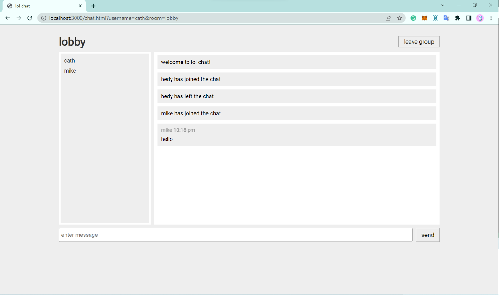
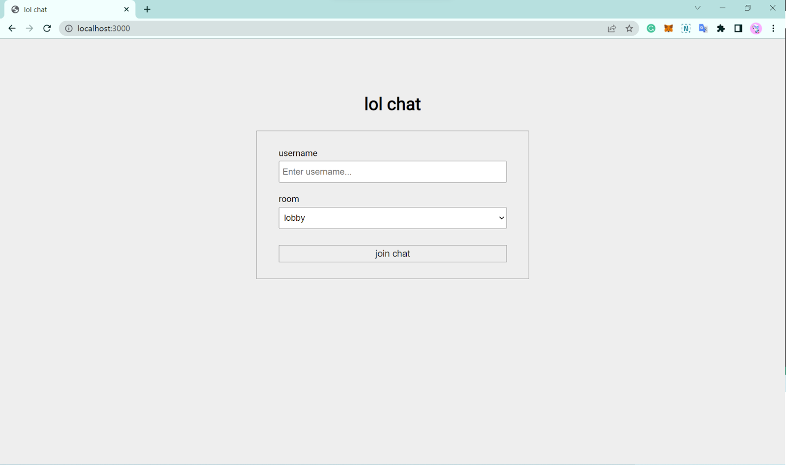

# LOLOL

A lite uncensored chat platform developed based on vanilla JavaScript and socket.io. [More features](https://github.com/catherineruoxiwu/lol-chat/issues) are coming.





## Try lol chat locally with multiple users
1. Clone the repository and run `npm install` and then `npm run start`.
2. Visit [localhost:3000/](localhost:3000).
3. Try the app with friends using the same Internet conenction using IP address. For example:
```bash
wrx@LAPTOP-KJTKJGUN:~$ ifconfig | grep inet
        inet 127.0.0.1  netmask 255.0.0.0
        inet6 ::1  prefixlen 128  scopeid 0xfe<compat,link,site,host>
        inet 192.168.0.131  netmask 255.255.255.0  broadcast 192.168.0.255
        inet6 fe80::39dc:b681:c1bd:b13e  prefixlen 64  scopeid 0xfd<compat,link,site,host>
```
In this case, visit [inet]:3000, in this case 192.168.0.131:3000/.

## More on socket.io
https://socket.io/docs/v4/emit-cheatsheet/